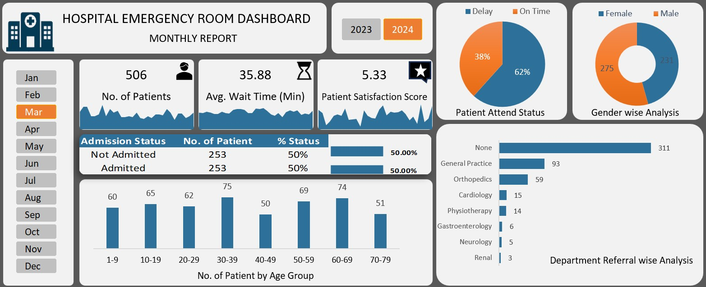

# 🛒 Ecommerce Sales Analysis Dashboard



## 📊 Project Overview

An interactive **Ecommerce Sales Analysis Dashboard** built in **Microsoft Excel** that provides a comprehensive view of sales performance, profitability, and product trends across different regions, categories, and customer segments.

---

## 🎯 Key Metrics Tracked

| Metric | Value | YOY Growth |
|---|---|---|
| 💰 Total Sales | $22,97,200.86 | ▲ 20.62% |
| 📈 Total Profit | $2,86,397.02 | ▲ 14.41% |
| 📦 Total Quantity | 37,873 | ▲ 27.45% |
| 🧾 No. of Orders | 9,994 | ▲ 28.64% |
| 💹 Profit Margin | 12.47% | ▼ 3.13% |

---

## 📌 Dashboard Features

- **Sales & Profit Analysis** — Monthly bar and line chart comparing Sum of Sales vs Sum of Profit across the year
- **Category Wise Profit** — Bar chart showing profit breakdown across Technology, Office Supplies, Furniture, and Grand Total
- **Category Wise Sales Share %** — Donut chart showing percentage contribution of each category
- **Sales by State** — Interactive US map showing geographic distribution of sales
- **Top 5 Subcategories by Sale** — Horizontal bar chart highlighting best-performing subcategories (Phones, Chairs, Storage, Tables, Binders)
- **Dynamic Filters** — Slicers for filtering by Year (2011–2014), Region (Central, East, South, West), and Segment (Consumer, Corporate, Home Office)

---

## 🛠️ Tools & Technologies Used

- **Microsoft Excel** — Dashboard creation, data analysis, and visualization
- **Excel Pivot Tables** — For dynamic data summarization
- **Excel Charts** — Bar charts, line charts, donut charts, and map charts
- **Excel Slicers** — For interactive filtering

---

## 📁 Project Structure

```
📂 Ecommerce Sales Analysis Dashboard
 ├── 📊 Ecommerce_Sales_Analysis.xlsx    # Main dashboard file
 ├── 🖼️ Ecommerce_Sales_Analysis_Dashboard.jpg  # Dashboard screenshot
 └── 🎬 ECOMMERCE_SALES_DASHBOARD.mp4   # Dashboard walkthrough video
```

---

## 💡 Key Insights

- 📱 **Phones** are the top-selling subcategory with **$330.01K** in sales
- 💻 **Technology** is the most profitable category with **$286.40K** in profit
- 📅 Sales show a strong **upward trend** in Q4 (October–December)
- 🗺️ Certain states show significantly higher sales concentration on the map
- 🏢 **Office Supplies** holds the largest sales share at **36.40%**

---

## 🚀 How to Use

1. Download the `Hospital Emergency Room Data.csv` file
2. Open it in **Microsoft Excel** (2016 or later recommended)
3. Use the **slicers** on the right side to filter by Year, Region, or Segment
4. All charts and KPIs will update dynamically based on your selection

---

## 👩‍💼 About the Author

**Binal** — Aspiring Data Analyst passionate about turning raw data into meaningful business insights using Excel, and other analytics tools.

📍 Vadodara, Gujarat, India

---

## 🤝 Connect With Me

- 💼 [LinkedIn](#) ← *(Add your LinkedIn URL here)*
- 📧 [Email](#) ← *(Add your Email here)*

---

⭐ If you found this project helpful, please give it a **star** on GitHub!
